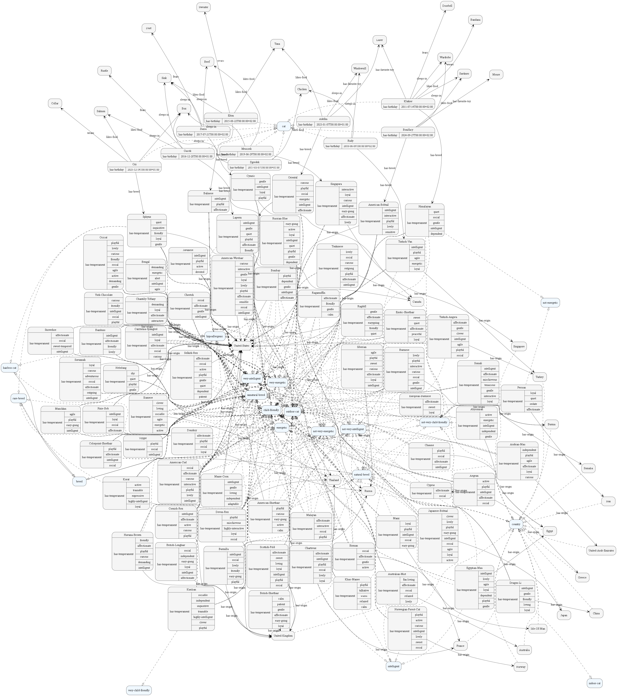
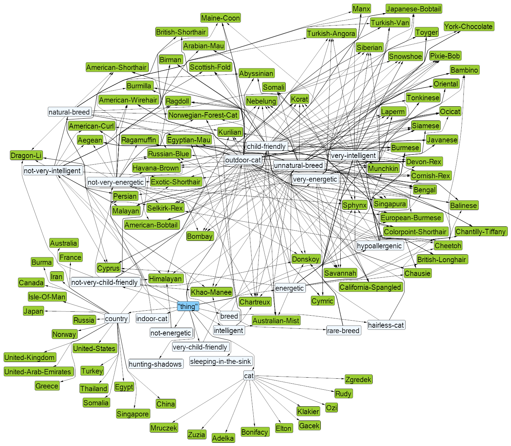

# Ontologia ras kotów

Projekt zaliczeniowy z przedmiotu **Sieci semantyczne** — ontologia ras kotów domowych opisana w języku Controlled English. Ontologia umożliwia zapytania semantyczne dotyczące cech ras, indywidualnych kotów oraz relacji między nimi.

## Opis projektu

Ontologia zawiera informacje na temat:

* ras kotów domowych (pochodzenie, długość życia, temperament, inteligencja, waga),
* indywidualnych kotów (data urodzenia, ulubiony pokarm, miejsce do spania, zabawki, hobby, emocje),
* relacji między kotami, rasami i środowiskiem,
* semantycznej reprezentacji danych w formacie Controlled English (ACE),
* graficznych reprezentacji struktury za pomocą Fluent Editora i biblioteki CogniPy.

## Zawartość projektu

### Główne pliki

| Plik          | Opis                                                                        |
| ------------- | --------------------------------------------------------------------------- |
| `breeds.json` | Dane o rasach kotów pobrane z TheCatAPI (kraj, waga, temperament itd.)      |
| `script.py`   | Skrypt przekształcający dane JSON do Controlled English (dla Fluent Editor) |
| `cats.ipynb`  | Notatnik Jupyter — analiza i wizualizacja grafu ontologii (CogniPy)         |

### Struktura ontologii

#### Klasy główne

* `breed` – rasa kota,
* `cat` – indywidualny kot,
* `country` – kraj pochodzenia.

#### Klasy opisowe (cechy)

* `very-intelligent`, `not-very-intelligent`,
* `very-energetic`, `not-energetic`,
* `very-child-friendly`, `hypoallergenic`,
* `indoor-cat`, `outdoor-cat`, `sleeping-in-the-sink`, `hunting-shadows`.

#### Relacje (object properties)

* `have-breed` – kot należy do rasy,
* `have-origin` – rasa pochodzi z kraju,
* `have-hobby`, `like-food`, `wear`, `sleep-in` – preferencje i zwyczaje,
* `have-short-legs`, `have-no-lap` – właściwości fizyczne,
* `fear`, `enjoy` – "reakcje" kotów.

#### Atrybuty (data properties)

* `have-birthday` – data urodzenia,
* `have-life-span-years` – zakres długości życia,
* `have-weight-kg` – waga minimalna i maksymalna,
* `have-temperament` – cechy temperamentu (np. „affectionate”, „playful”).

## Wizualizacja ontologii

Struktura ontologii została przedstawiona w postaci grafu:

* wygenerowanego w Jupyter Notebook za pomocą **CogniPy**,
  
* oraz w formie diagramu **CNL Diagram** w **Fluent Editorze**.
  

## Możliwości wykorzystania

Ontologia może zostać użyta w:

* systemach doradczych wspomagających adopcję kotów,
* edukacyjnych encyklopediach i grach semantycznych,
* wyszukiwarkach semantycznych kotów wg cech (np. „inteligentny, hipoalergiczny”).

Możliwe jest też jej rozszerzenie o:

* warunki życia, potrzeby pielęgnacyjne,
* integrację z API zdjęć lub danych adopcyjnych.
